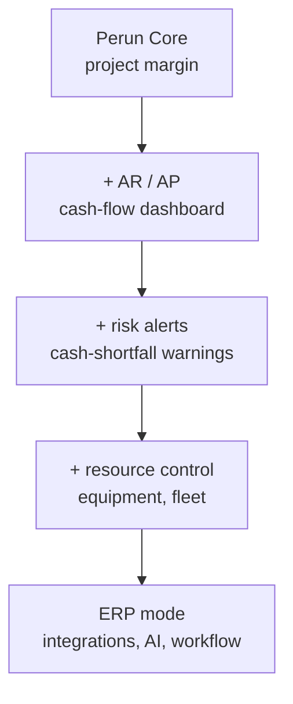

# 🧭 ROD System — Vision

**Financial control for project-based operational firms — see whether you'll profit or go broke, in 30 seconds.**

_Kontrola finansów firm projektowych — w 30 sekund wiesz, czy zarobisz, czy zbankrutujesz._

> _Rod — the Slavic creator-god, bringer of order out of chaos. The name fits: ROD brings order to a project firm's money._

---

> ## 🧭 STATUS: VISION DOC — not a build spec
> This file exists to **capture intent so it isn't forgotten** — nothing more.
> - **Do not start building** until **Perun Core** ships and has paying customers.
> - The scope below **will and should change** based on what those customers actually ask for.
> - When the time comes, this turns into a detailed, agent-ready README like Perun's — **not before.**

---

## What ROD is

The **financial-control layer / operational ERP** for project-based operational businesses — construction, installation, industrial, made-to-order.

It is **not a generic ERP**. It's an _anti-ERP_: it starts from **cash flow and cost control**, not from accounting compliance.

The one-line difference from Perun:

> **Perun answers:** _"Is THIS project profitable?"_
> **ROD answers:** _"Is the whole COMPANY going to make money — and when do I run out of cash?"_

---

## Relationship to Perun Core (read this first)

- **Perun Core** = project-first CRM. One project's margin (planned budget vs actual cost).
- **ROD** = the company-wide financial-control system that **Perun grows into**: cash flow, AR/AP, runway, resources, multi-project portfolio.
- **Strategy:** land-and-expand. Perun is the wedge; ROD is the expansion.

> ⚠️ **Open question to decide LATER (not now):** is ROD a separate product, or simply Perun's mature form?
> Decide from **real customer demand**, not from a whiteboard. The most likely path: Perun's users start asking _"can I also see my cash flow / all my projects at once / who owes me?"_ — and **that pull defines ROD.**

---

## Core promise

> _"Control your company's cash and predict the shortfall before it happens."_

The customer pays for **peace of mind**, not for a feature list.

---

## Who it's for

Bigger / more mature project firms than Perun's entry wedge — those juggling **multiple projects** at once, with real AR/AP and payroll pressure. (Perun lands the small operator; ROD keeps them as they grow.)

---

## Scope buckets (value layers — NOT a roadmap)

1. **Cash-flow Engine** — AR/AP, invoice status (`paid` / `unpaid` / `overdue`), cash-flow dashboard, **cash runway** ("when do I run out of money?"). _Always build this first._
2. **Reality Layer** — real bank transactions vs invoices; risk alerts ("no cash for payroll in 14 days", "this client is 30 days late").
3. **Resource Control** — equipment, fleet, assignment to projects; planned vs actual utilisation.
4. **ERP Mode** — integrations (bank, accounting, **KSeF**), automations, AI, workflow.

---

## Why it can win (vs Comarch Optima / enova365 / Symfonia)

- The incumbents win **compliance** but lose on **UX and operational simplicity** — legacy stacks, heavy implementation, closed interfaces.
- ROD's edge: **modern self-serve SaaS**, **Polish + KSeF-native**, **project-margin DNA carried over from Perun**, fast time-to-value, and the **cash-shortfall prediction** that the dinosaurs bury inside bloated modules.
- **KSeF is the fuel.** Structured B2B invoice data (mandatory in Poland from 2026) flows in automatically, so the cash-flow + cost picture **builds itself** with minimal manual entry. This is the same "frictionless capture" edge that powers Perun — extended to the whole company.

---

## Monetization sketch (rough — refine later)

- **Setup / onboarding:** one-time, premium (hands-on if needed).
- **MRR tiers:** solo → team → company.
- **Upsell:** resource module, multi-project portfolio, advanced reporting.
- Optimise for **high LTV + low churn**. Customers pay for control, not for clicks.

---

## What NOT to do

- ❌ Don't build ROD before **Perun proves the wedge and has paying users**.
- ❌ Don't try to **out-feature Comarch** — you'll lose. Win on focus + UX + the one painful workflow.
- ❌ Don't build all four buckets at once. **Cash-flow Engine first**, always.
- ❌ Don't design it in a vacuum — **let Perun's customers tell you** what ROD needs.

---

## Branding note (same channel-conflict rule as Perun)

If ROD sells to construction firms, keep its **public brand arm's-length** from any construction company you run (e.g. Veles Construction). Competitors will not feed their financial data to a rival. **One quiet brand, separate customer-facing face** — the legal entity can sit wherever it makes sense.

---

## When this becomes a real build-README

Convert this vision into a detailed, agent-ready spec (SQL schema, RLS, roadmap, agent rules — like Perun's) **only when**:

1. Perun Core has **paying customers**, and
2. you've heard the same _"I also need to see [cash flow / all projects / who owes me]"_ from **enough of them** that the next module is obvious.

Until then, this page is enough. Don't gold-plate a product you haven't earned the right to build yet.

---

**ROD System** — _order out of chaos, one złoty at a time._

